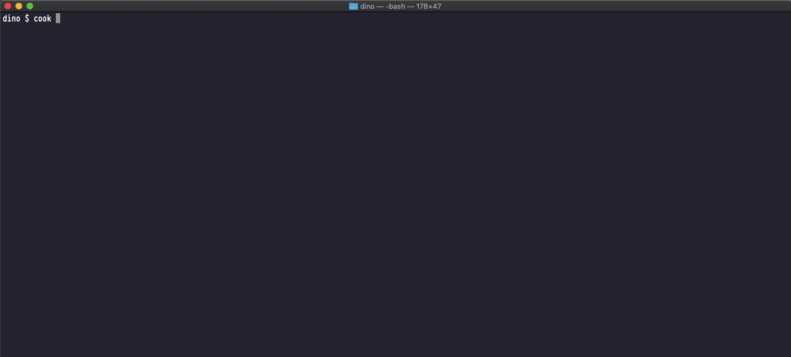

# terminal-cooker [](https://travis-ci.org/dinodsaurus/terminal-cooker)

> Master chef inside your terminal




## Install

```
$ npm install --global terminal-cooker
```

## Getting of API token
Register on [RapidApi](https://rapidapi.com/spoonacular/api/recipe-food-nutrition) and grab your api token.

Save the token to your app with:
```
$ cook --token=1a2b3c
```


## Usage

```js
$ cook --help
Usage
	$ cook [ingredients]

Options
	--token  Spoonacular API token

Examples
	$ cook --token=1a2b3c
	info Token saved: 1a2b3c
	$ cook eggs ham
	Square Deviled Eggs - [eggs, ham, cream cheese]
```


## License

MIT © [Dino Trojak](https://dinodsaur.us)
